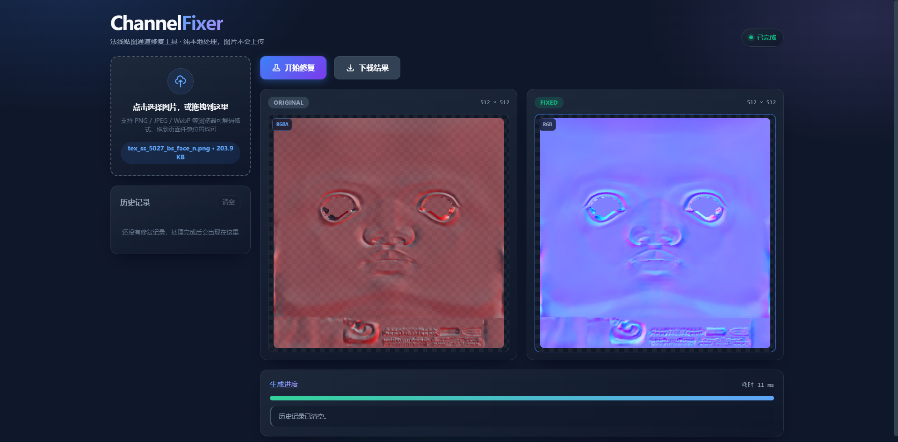

# ChannelFixer · 法线贴图通道修复工具

一个轻量、纯前端的图片通道编辑器，专为法线贴图等通道重排场景设计。支持本地图片拖拽预览与一键修复，无需安装后端服务或第三方依赖。


## 功能特性
- 支持本地图片选择与拖拽导入，**拖到页面任意位置**均可导入，且不会触发浏览器直接打开图片
- 预览区并排展示“原图”和“修复后”两张卡片，点击可**在页面内浮层**按原尺寸放大查看（不依赖弹窗，不会被拦截）
- 预览浮层内可**单独查看任意通道**：合成视图或 `R` / `G` / `B` / `A` 单通道，支持灰度与 RGB 着色两种呈现方式，原图与修复结果都适用
- 通道修复逻辑：
  - 绿色通道黑白翻转（`G = 255 - G`）
  - 透明通道拷贝到红通道（`R = A`）
  - 红通道拷贝到蓝通道（`B = R`）
  - 丢弃原图蓝通道，并将透明通道设为不透明（`A = 255`）
- 左侧历史记录带缩略图、名称、分辨率与时间戳，支持单条下载、单条移除与“清空”
- 每个预览框左上角显示通道信息徽标：原图自动识别 `RGB/RGBA`，修复结果为 `RGB`
- 页面内可见的状态区（就绪 / 处理中 / 完成 / 警告 / 失败）与真实进度条，处理与导出都有明确反馈
- 响应式布局：宽屏双栏、中屏收窄侧栏、窄屏单列堆叠（上传 → 控制 → 预览 → 进度 → 历史）
- 纯前端实现，无后端依赖，图片不会上传到任何服务器

## 在线预览
本项目为纯静态网页，推荐通过任意静态服务器打开（可获得后台线程处理能力）。例如：
```
python -m http.server 8000
```
启动后访问：
```
http://localhost:8000/
```
如果 IPv6 地址不可用，请使用上述 IPv4 地址而非 `http://[::]:8000/`。

也可以直接双击 `index.html` 以 `file://` 方式打开，功能完全可用；区别在于：

| 运行方式 | 处理执行 | 说明 |
| --- | --- | --- |
| 静态服务器（http/https） | Web Worker 后台线程 | 界面在处理大图时保持顺滑 |
| 直接打开（`file://`） | 主线程分片 + 请求动画帧 | 浏览器会拦截 `file://` 下的 Worker/模块加载，页面自动降级 |

页面会在降级时提示“已自动切换为主线程处理”，无需手动配置。

## 使用指南
1. 打开页面后，点击上传区域或将图片拖到页面任意位置
2. 主区并排显示原图与修复后卡片，左上角显示通道信息；若输入不含透明通道会有明确提醒
3. 点击“开始修复”，进度条与状态区会实时反映处理进度与耗时
4. 处理完成后点击“下载结果”保存为 PNG；左侧历史记录中可单独下载、移除或整体清空
5. 点击任一预览图可在页内浮层查看原尺寸，按 `Esc` 或点击遮罩关闭
6. 在浮层内用通道切换条查看单通道：`合成` / `R` / `G` / `B` / `A`，并可在“灰度”与“RGB 着色”之间切换

## 单通道预览
排查法线贴图问题时，最难判断的往往不是“图长什么样”，而是“某个通道里到底有什么”。浮层内的通道切换条把这件事变成一次点击：

| 视图 | 用途 |
| --- | --- |
| `合成` | 彩色原貌，用于确认整体观感 |
| `R` / `G` / `B` | 查看单个颜色通道的灰度分布，快速定位脏数据、接缝、烘焙残留 |
| `A` | 查看透明通道。对本工具而言这是关键通道——修复时红通道正是取自它 |
| 灰度 / RGB 着色 | 灰度适合读数值；RGB 着色把通道涂成对应原色，适合快速确认“这张图缺的是哪个通道” |

几点说明：
- **通道值一律按不透明渲染。** 预览画布衬在棋盘格底色上，若保留原 alpha，半透明区域的灰度会被底色混合，读到的数不等于真实通道值。
- **“RGB 着色”只对单通道有意义。** 它没有对应的 A 通道原色，因此在 `A` 上等同于灰度；在`合成`视图下点击会提示该模式不生效。
- **切换不改变修复逻辑，也不会影响下载结果。** 它只是读取已完成的结果，不重新计算通道映射。
- 大图切换通道会分片执行，界面保持可响应，浮层右下角会显示本次提取耗时。

## 支持格式
- 浏览器原生可解码的图片格式：`PNG`, `JPEG`, `WebP`, `GIF`, `BMP`, `AVIF`
- `TGA` / `EXR` / `DDS` 等浏览器不支持解码的格式会被明确拒绝，并提示先转换为 PNG 或 JPEG
- 处理上限：单张图片像素总量约 3355 万（≈ 8192 × 4096），单文件 150MB；超限会给出可读提示而非卡死

## 使用须知
- 修复是**不可逆**的通道重排：当输入不含透明通道（例如普通 JPEG/PNG）时，红通道会被整体置为 255，原红通道信息将丢失。页面在载入此类图片时会给出警告。
- 结果统一导出为 PNG，因此透明通道信息（`A = 255`）不会被 JPEG 压缩破坏。

## 技术栈
- 原生 `HTML/CSS/JavaScript`（经典脚本，无构建步骤、无 npm 依赖）
- 使用 `Canvas 2D` 进行逐像素处理与预览
- 使用 `Web Worker` 承担逐像素计算，配合 `Transferable` 零拷贝传输；不可用时自动降级为主线程分片
- 导出使用 `canvas.toBlob` + `URL.createObjectURL`，不产生 base64 体积膨胀
- 字体使用本地优先字体栈（`Inter` / `system-ui` / `PingFang SC` / `Microsoft YaHei`），**无任何外部请求**，离线可用

## 项目结构
```
FixNormalMapChannel/
├── index.html        # 页面结构与 UI
├── style.css         # 深色科技风主题、响应式布局与动效
├── algorithm.js      # 算法层：通道映射、单通道提取与通道信息判定（无 DOM 依赖）
├── worker.js         # 执行层：后台线程分片计算
├── script.js         # 交互层：状态机、任务调度、历史记录、导出
├── tex_ss_5027_bs_face_n.png  # 示例法线贴图
├── FixNormalMapChannel.png    # README 配图
├── LICENSE
└── README.md
```

## 参与开发

> **给外部贡献者的重要说明**
>
> `main` 分支受保护，且仅维护者可直接推送。
> **请向 `dev` 分支提交 Pull Request；直接向 `main` 提交的 PR 大概率不会受理。**

推荐流程：

1. Fork 本仓库到你自己账号
2. 从 `dev` 分支切出特性分支（`git checkout -b feature/xxx`）
3. 提交改动并推送到你的 Fork
4. 向本仓库的 **`dev` 分支** 开 Pull Request，等待 CI 通过与合并

分支流向：`feature/xxx` → `dev`（日常集成）→ `main`（发布版本）

## 开发与部署
- 静态部署到任意静态托管平台（GitHub Pages、Netlify、Vercel 等）
- 或本地运行任意静态服务器（如 `http-server`, `python -m http.server`）

## 后续规划
- `TGA`/`EXR` 等更多格式支持（需要引入解码器，届时会带来体积与许可成本）
- 批量处理与队列导出
- 键盘快捷键与完整的无障碍支持

## 许可
[MIT License](LICENSE)
